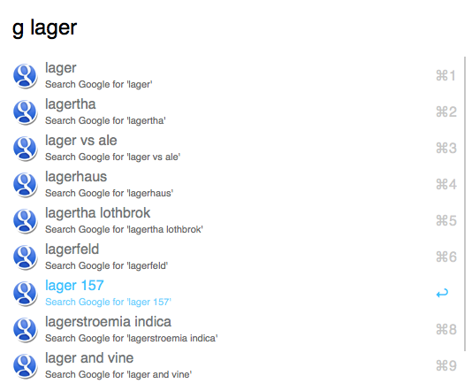
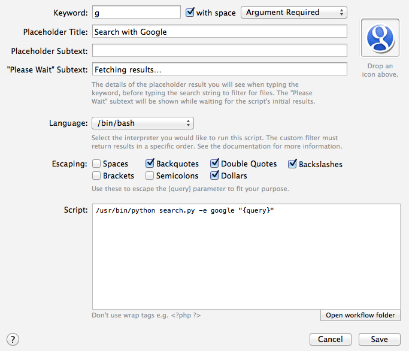

# Searchio! workflow for Alfred #

Auto-suggest search results from multiple search engines and languages.




Supports the following search engines/websites:

- Google
- Wikipedia
- Wiktionary
- DuckDuckGo
- Bing
- Yahoo!
- Ask.com

There are some example searches configured by default (with and without keywords). To add a new one, either copy/paste an existing one, or create a new Script Filter as follows:



**Note:** Be sure to select the same escaping options as in the screenshot (Backquotes, Double Quotes, Backslashes, Dollars).

By default, your system language will be used. To specify a custom language:


## Icons ##

Icons for each search engine can be found in the `icons` subirectory of the Workflow.

## Languages ##

The `-l` or `--language` argument to `search.py` doesn't follow any hard-and-fast rules: it depends on the search engine you're using. With some search engines (Google, Wikipedia, Wiktionary, Bing, DuckDuckGo), it's a language, e.g. `uk` = Ukrainian. In others (Yahoo!, Ask), it's treated as a region, e.g. `uk` = United Kingdom.

Some search engines (Bing, DuckDuckGo) do not provide language-specific suggestions, but actioning the result will open a list of language-specific results in your browser.

## Search engines ##

The following search engines are supported. Pass the `id` to the `-e`/`--engine` argument of `search.py` to search using that engine. If `--engine` is not specified, Google will be used.

|     id     |    Name    |
|------------|------------|
| google     | Google     |
| wikipedia  | Wikipedia  |
| wiktionary | Wiktionary |
| ddg        | DuckDuckGo |
| bing       | Bing       |
| yahoo      | Yahoo!     |
| ask        | Ask.com    |

### Wikipedia, Wiktionary ###

The `--language` argument will be treated as a subdomain, e.g. `de` will retrieve results from `de.wikipedia.org`.

### Google ###

The `--language` argument should work for [any language supported by Google](https://www.google.com/preferences#languages), with the obvious exceptions of things like Klingon and Hacker…

### Bing, DuckDuckGo ###

Bing and DuckDuckGo do not provide language-specific suggestions, but the results opened in your browser should be restricted to the specified language.

### Ask, Yahoo! ###

Ask.com and Yahoo! do not provide language-specific search suggestions/results, but rather region-specific ones. In many cases, this won't make a difference (e.g. `--language de` and `--language fr` will provide German and French results respectively), however the behaviour is different in some cases, e.g. `uk` means "United Kingdom", not "Ukrainian".

## Examples ##

Use these in the `Script` field of a Script Filter.

```bash
# Google (default engine) in your system (default) language
/usr/bin/python search.py "{query}"

# Google in German
/usr/bin/python search.py -l de "{query}"

# Google in French
/usr/bin/python search.py -l fr "{query}"

# Google in Brazilian Portuguese
/usr/bin/python search.py -l pt-BR "{query}"

# DuckDuckGo in system (default) language
/usr/bin/python search.py -e ddg "{query}"

# DuckDuckGo in Spanish
/usr/bin/python search.py -e ddg -l es "{query}"

# Yahoo! UK
/usr/bin/python search.py -e yahoo -l uk "{query}"

# Yahoo! Australia
/usr/bin/python search.py -e yahoo -l au "{query}"

# Wikipedia in Simple English
/usr/bin/python search.py -e wikipedia -l simple "{query}"

# Wikipedia in Polish
/usr/bin/python search.py -e wikipedia -l pl "{query}"

# Wiktionary in Spanish
/usr/bin/python search.py -e wiktionary -l es "{query}"
```

## Licensing, thanks ##

The code in this workflow is released under the [MIT Licence](http://opensource.org/licenses/MIT).

The icons belong to the respective search engines.

This workflow uses the [Alfred-Workflow](http://www.deanishe.net/alfred-workflow/) library and [docopt](http://docopt.org/) (both MIT-licensed).
